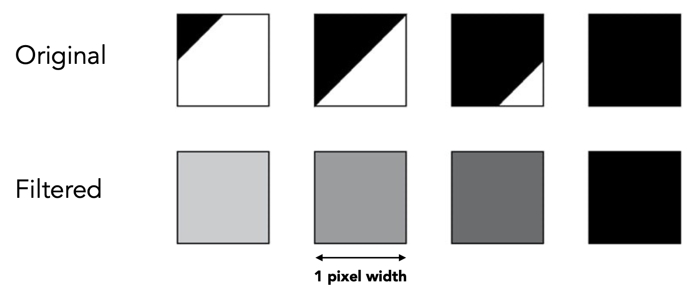
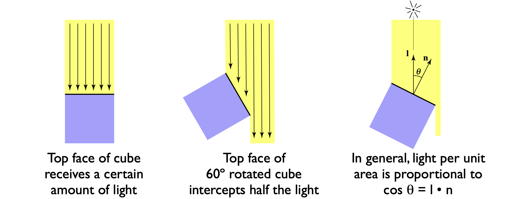

# Rasterization

## Projection

### Orthographic Projection

$[l,r]\times[b,t]\times[f,n]$ to $[-1,1]^3$

$$
\mathbf{M}_{\text{ortho}} = \begin{pmatrix}
\frac{2}{r-l} & 0 & 0 & 0 \\
0 & \frac{2}{t-b} & 0 & 0 \\
0 & 0 & \frac{2}{n-f} & 0 \\
0 & 0 & 0 & 1
\end{pmatrix}
\begin{pmatrix}
1 & 0 & 0 & -\frac{r+l}{2} \\
0 & 1 & 0 & -\frac{t+b}{2} \\
0 & 0 & 1 & -\frac{n+f}{2} \\
0 & 0 & 0 & 1
\end{pmatrix}
$$


### Perspective Projection

$$
\mathbf{M}_{\text{persp}\to\text{ortho}} = \begin{pmatrix}
n & 0 & 0 & 0 \\
0 & n & 0 & 0 \\
0 & 0 & n+f & -nf \\
0 & 0 & 1 & 0
\end{pmatrix}
$$

$$
\mathbf{M}_{\text{persp}} = \mathbf{M}_{\text{ortho}}\mathbf{M}_{\text{persp}\to\text{ortho}}
$$

## Viewing

### Perspective Projection

$$
\tan{\dfrac{fovY}{2}=\dfrac{t}{|n|}}
$$

$$
aspect = \dfrac{r}{t}
$$

### Canonical Cube to Screen

$[-1,1]^2\to [0, \text{width}]\times [0, \text{height}]$

$$
\mathbf{M}_{\text{viewport}} = 
\begin{pmatrix}
\dfrac{\text{width}}{2} & 0 & 0 & \dfrac{\text{width}}{2}\\
0 & \dfrac{\text{height}}{2} & 0 & \dfrac{\text{height}}{2}\\
0 & 0 & 1 & 0\\
0 & 0 & 0 & 1
\end{pmatrix}
$$

???+ question "Quiz"

	If we transform frustum into cuboid. For those points between $n$ and $f$, are they close to $n$ or $f$?

???- quote "Solution"

	> This solution is from [BBS](https://games-cn.org/forums/topic/guanyulecture-04-kehousikaoti-xiangduigedaan/) @striveant

	First, $\mathbf{M}_{\text{persp}\to\text{ortho}}$ is given above. Let $A = \begin{pmatrix}0\\0\\z\\1\end{pmatrix}$, where $z = \dfrac{n+f}{2}$.

	Apply $\mathbf{M}_{\text{persp}\to\text{ortho}}$ on $A$:

	$$
	\mathbf{M}_{\text{persp}\to\text{ortho}} A = 
	\begin{pmatrix}
	0\\0\\\frac{n+f}{2}(n+f)-nf\\\frac{n+f}{2}
	\end{pmatrix} = 
	\begin{pmatrix}
	0\\0\\\frac{n^2+f^2}{n+f}\\1
	\end{pmatrix}
	\stackrel{\text{def}}{=}
	\begin{pmatrix}0\\0\\z'\\1\end{pmatrix}
	$$

	Since $f<z<n<0$,

	$$
	z-z' = \frac{n+f}{2} - \frac{n^2+f^2}{n+f} = -\frac{(n-f)^2}{2(n+f)} > 0
	$$

	This means the point is closer to $f$.

	More general,

	$$
	\mathbf{M}_{\text{persp}\to\text{ortho}} A =
	\begin{pmatrix}
	0\\0\\z(n+f)-nf\\z
	\end{pmatrix}=
	\begin{pmatrix}
	0\\0\\n+f-\frac{nf}{z}\\1
	\end{pmatrix}
	\stackrel{\text{def}}{=}
	\begin{pmatrix}0\\0\\z'\\1\end{pmatrix}
	$$

	$$
	\begin{aligned}
	z-z' &= z - (n+f-\frac{nf}{z})\\
	&= (z-n) - f(1-\frac{n}{z})\\
	&= \frac{1}{z}(z-n)(z-f) > 0
	\end{aligned}
	$$

	This means the point is closer to $f$.

## Antialiasing

### Before Antialiasing

#### Sampling Artifacts

Jaggies, Moire, Wagon wheel effect...

#### Idea: Blurring Before Sampling

> Sample then filter, WRONG!

### Frequency Domain

#### Fourier Series & Transform

- Higher Frequencies Need Faster Sampling

- Undersampling Creates Frequency Aliases

Filtering = Getting rid of certain frequency contents

#### Filtering = Convolution

Convolution in the spatial domain = Multiplication in the frequency domain

##### Option 1

- Filter by convolution in the spatial domain

##### Option 2

- Transform to frequency domain (Fourier transform)
- Multiply by Fourier transform of convolution kernel
- Transform back to spatial domain (inverse Fourier)

#### Sampling = Repeating Frequency Contents

Sparse sampling will cause aliasing

How can we reduce aliasing error?

##### Option 1: Increase samling rate

- Essentially increasing the distance between replicas in the Fourier domain
- Higher resolution displays, sensors, framebuffers...
- BUT: costly & may need very high resolution

##### Option 2: Antialiasing

- Making Fourier contents "narrower" before repeating
- i.e. **Filtering out high frequencies before sampling**

###  Antialiasing

A 1 pixel-width box filter (low pass, blurring)

#### Antialiasing By Averaging Values in Pixel Area

##### Solution:

- **Convolve**: $f(x,y)$ by 1-pixel box-blur
- **Then sample** at every pixel's center

#### Antialiasing by Computing Average Pixel Value

In rasterizing one triangle, the average value inside a pixel area of $f(x,y) = inside(triangle,x,y)$ is equal to the area of the pixel covered by the triangle.



### Antialiasing By Supersampling (MSAA)

MSAA = Muti-Sample-Anti-Aliasing

#### Supersampling

Sampling multiple locations within a pixel

##### Step 1

- Take $N\times N$ samples in each pixel

##### Step 2

- Average the $N\times N$ samples "inside" each pixel

##### Step 3 Result

### Antialiasing Today

No free lunch!

- Cost of MSAA

Milestones

- FXAA (Fast Approximate AA)
- TAA (Temporal AA)

Super resolution / super sampling

- From low res to high res
- Essentially still "not enough samples" problem
- DLSS (Deep Learning Super Sampling)

## Visibility / Occlusion

#### Painter's Algorithm

Requires sorting in depth, can have unresolvable depth order

### Z-Buffer (深度缓存)

#### Idea

- Store current min. z-value **for <u>each</u> sample (pixel)**

- Needs an additional buffer for depth values
  - frame buffer stores color values
  - depth buffer (z-buffer) stores depth

> [!IMPORTANT]
>
> For simplicity we suppose **z is always positive**

#### Step

- Initialize depth buffer to $\infty$
- During rasterization:

```c
for (each triangles T)
  for (eachsample(x, y, z) in T)
    if (z < zbuffer[x, y])           // closest sample so far
      framebuffer[x, y] = rgb;       // update color
      zbuffer[x, y] = z;             // update depth
    else
    	;                   // do nothing, this sample is occluded
```

#### Complexity

- $O(n)$ for $n$ triangles (assuming constant coverage)

> Most important visibility algorithm, Implemented in hardware for all GPUs

## Shading

Definition in this course: The process of applying a material to an object.

### Blinn-Phong Reflectance Model


$$
L = L_a + L_d + L_s
$$

Compute light reflected toward camera

**No shadows** will be generated! (shading $\neq$ shadow)

#### Diffuse Reflection

Lambert's Cosine Law:



Shading **independent** of view direction

$$
L_d = k_d(I/r^2)\max(0, \mathbf{n}\cdot\mathbf{l})
$$

#### Specular Term

Intensity **depends** on view direction

- Bright near mirror reflection direction

- $\mathbf{v}$ close to mirror direction $\Leftrightarrow$ **half vector** near normal

$$
\mathbf{h} = \text{bisector}(\mathbf{v},\mathbf{l}) = \frac{\mathbf{v} + \mathbf{l}}{\|\mathbf{v}+\mathbf{l}\|}
$$

$$
\begin{aligned}
L_s &= k_s(I/r^2)\max(0, \cos\alpha)^p\\
&= k_s(I/r^2)\max(0, \mathbf{n} \cdot \mathbf{h})^p
\end{aligned}
$$

#### Ambient Term

Shading that does not depend on anything

- Add constant color to account for disregarded illumination and fill in black shadows

- This is approximate / fake!

$$
L_a = k_aI_a
$$

### Shading Frequencies

Shade each triangle (flat shading)

Shade each vertex (Gourand shading)

Shade each pixel (Phong shading)

## Texture